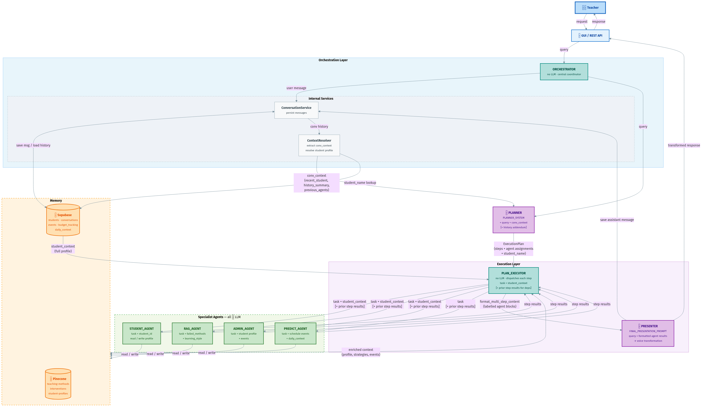

# Co-Teacher: Multi-Agent AI System for Special Education

A multi-agent AI system designed to assist special education teachers with student management, teaching strategies, administrative tasks, and daily predictions. Built as a final project for the AI Agents course.

## Team Information

- **Team Name**: avi_yehoraz_maya
- **Batch/Order**: batch_1_order_9
- **Members**:
  - Avi Simkin (avi.simkin@campus.technion.ac.il)
  - Yehoraz Ben-Yehuda (yehoraz.ben@campus.technion.ac.il)
  - Maya Meirovich (mmeirovich@campus.technion.ac.il)

## Project Overview

Co-Teacher is an autonomous AI agent that helps special education teachers by:
- Retrieving and updating student profiles, triggers, and learning preferences
- Recommending evidence-based teaching strategies via RAG (Retrieval-Augmented Generation)
- Generating administrative documents (IEP reports, parent communications, summaries)
- Providing daily briefings and predictions about potential student challenges

## Architecture

The system uses a **multi-agent architecture**:




### Agent Descriptions

| Agent | Purpose | Example Queries |
|-------|---------|-----------------|
| **STUDENT_AGENT** | Student profiles, triggers, history | "What are Alex's triggers?" |
| **RAG_AGENT** | Teaching strategies and methods | "How do I handle a meltdown?" |
| **ADMIN_AGENT** | Documents, IEPs, communications | "Draft a progress report for Alex" |
| **PREDICT_AGENT** | Daily briefings and predictions | "What should I watch for today?" |

### Optimization Strategies

1. **Rule-Based Routing**: Pattern matching routes ~60% of queries without LLM calls
2. **Response Caching**: Frequently-asked strategy queries are cached
3. **Lazy Agent Initialization**: Agents are only created when needed
4. **Minimal Context**: Only relevant conversation history is included in prompts

## API Endpoints

### GET /api/team_info
Returns team member information.

### GET /api/agent_info
Returns agent description, purpose, prompt templates, and examples.

### GET /api/model_architecture
Returns a PNG image of the system architecture.

### POST /api/execute
Main entry point for agent interaction.

**Request:**
```json
{
  "prompt": "What strategies work for teaching reading to students with dyslexia?"
}
```

**Response:**
```json
{
  "status": "ok",
  "error": null,
  "response": "Here are evidence-based strategies for teaching reading...",
  "steps": [
    {
      "module": "ORCHESTRATOR",
      "prompt": {"action": "routing", "query": "..."},
      "response": {"agent": "RAG_AGENT", "confidence": 0.9}
    },
    {
      "module": "RAG_AGENT",
      "prompt": {"query": "...", "context": "..."},
      "response": {"strategies": [...]}
    }
  ]
}
```

### GET /health
Health check endpoint for Render deployment.

## Technology Stack

- **Framework**: FastAPI
- **LLM Provider**: LLMod.ai (gpt-5-mini)
- **Short-term Memory**: Supabase (conversations, messages)
- **Long-term Memory**: Pinecone (student profiles, teaching methods)
- **Deployment**: Render

## Local Development

### Prerequisites
- Python 3.11+
- pip

### Installation

```bash
# Clone the repository
git clone <repo-url>
cd co_teacher

# Create virtual environment
python -m venv venv
source venv/bin/activate  # On Windows: venv\Scripts\activate

# Install dependencies
pip install -r requirements.txt
```

### Environment Variables

Create a `.env` file with:
```env
LLMOD_API_KEY=your_api_key
LLMOD_BASE_URL=https://api.llmod.ai/v1
SUPABASE_URL=your_supabase_url
SUPABASE_KEY=your_supabase_key
PINECONE_API_KEY=your_pinecone_key
PINECONE_INDEX_NAME=co-teacher

# For local testing without external services
USE_MOCK_SERVICES=true
```

### Running the Server

```bash
# Development mode with auto-reload
uvicorn app.main:app --reload --host 0.0.0.0 --port 8000

# Or using Python directly
python -m app.main
```

Access the application:
- **Web UI**: http://localhost:8000
- **API Docs**: http://localhost:8000/docs


## Project Structure

```
co_teacher/
├── app/
│   ├── agents/              # Agent implementations
│   │   ├── orchestrator.py  # Central coordinator
│   │   ├── student_agent.py # Student profile management
│   │   ├── rag_agent.py     # Teaching strategies (RAG)
│   │   ├── admin_agent.py   # Administrative documents
│   │   └── predict_agent.py # Daily briefings
│   ├── api/
│   │   └── routes/          # API endpoint handlers
│   ├── core/
│   │   ├── router.py        # Rule-based routing logic
│   │   ├── llm_client.py    # LLMod.ai client with budget tracking
│   │   ├── step_tracker.py  # Execution step tracing
│   │   └── cache.py         # Response caching
│   ├── memory/
│   │   ├── supabase_client.py  # Short-term memory
│   │   ├── pinecone_client.py  # Long-term memory (vectors)
│   │   └── memory_manager.py   # Unified memory interface
│   ├── services/            # Orchestrator helper services
│   └── main.py              # FastAPI application
├── static/
│   ├── index.html           # Web UI
│   └── architecture.mmd     # Architecture diagram (Mermaid)
├── tests/
├── requirements.txt
└── README.md
```

