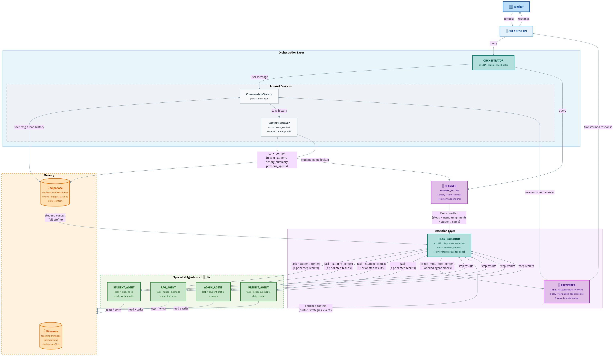

# Co-Teacher: Multi-Agent AI System for Special Education

A multi-agent AI system designed to assist special education teachers with student management, teaching strategies, administrative tasks, and daily predictions. Built as a final project for the AI Agents course.

## Team Information

- **Team Name**: avi_yehoraz_maya
- **Batch/Order**: batch_1_order_9
- **Members**:
  - Avi Simkin (avi.simkin@campus.technion.ac.il)
  - Yehoraz Ben-Yehuda (yehoraz.ben@campus.technion.ac.il)
  - Maya Meirovich (mmeirovich@campus.technion.ac.il)

## Project Overview

Co-Teacher is an autonomous AI agent that helps special education teachers by:
- Retrieving and updating student profiles, triggers, and learning preferences
- Recommending evidence-based teaching strategies via RAG (Retrieval-Augmented Generation)
- Generating administrative documents (IEP reports, parent communications, summaries)
- Providing daily briefings and predictions about potential student challenges

## Architecture

The system uses a **multi-agent architecture** with LLM-based planning:



### How It Works

1. **Teacher sends a query** via `POST /api/execute`
2. **StepTracker** is initialized for request-scoped tracing of all steps
3. **ConversationService** stores the message and retrieves conversation history
4. **ContextResolver** extracts context (recent student, topic) from history
5. **LLMPlanner** decomposes the query into typed plan steps (e.g., `student_lookup`, `rag_search`, `admin_doc`, `predict`, `synthesize`)
6. **PlanExecutor** dispatches each step to the appropriate specialized agent
7. For multi-step plans, **PlanExecutor** synthesizes the combined results via an LLM call
8. **Presenter** applies voice transformation to create a natural teacher-friendly response
9. All steps (with cost, tokens, timing) are returned in the response for full observability

### Agent Descriptions

| Agent | Purpose | Example Queries |
|-------|---------|-----------------|
| **STUDENT_AGENT** | Student profiles, triggers, learning styles, implicit update detection | "What are Alex's triggers?" |
| **RAG_AGENT** | Evidence-based teaching strategies via Pinecone vector search | "How do I handle a meltdown?" |
| **ADMIN_AGENT** | IEP reports, parent emails, daily/weekly summaries | "Draft a progress report for Alex" |
| **PREDICT_AGENT** | Daily briefings, risk analysis against student triggers | "What should I watch for today?" |

### Services

| Service | Role |
|---------|------|
| **ConversationService** | Conversation CRUD and message persistence in Supabase |
| **ContextResolver** | Extracts context from conversation history, resolves student identity |
| **LLMPlanner** | Decomposes teacher queries into typed plan steps via LLM |
| **PlanExecutor** | Executes plan steps sequentially, dispatching to agents and synthesizing results |
| **Presenter** | Transforms raw agent output into the teacher's communication voice |

### Memory Architecture

| Store | Type | Contents |
|-------|------|----------|
| **Supabase** | Short-term (PostgreSQL) | `students`, `conversations`, `conversation_messages`, `daily_context`, `events`, `schedule_templates`, `budget_tracking`, `response_cache`, `alerts_sent`, `pending_feedback` |
| **Pinecone** | Long-term (Vector DB) | `student-profiles` namespace (student embeddings), `teaching-methods` namespace (teaching methods KB) |

### Optimization Strategies

1. **LLM-Based Planning**: Decomposes complex queries into minimal agent calls
2. **Two-Tier Response Caching**: Supabase + in-memory cache for RAG and Admin queries
3. **Budget Tracking**: Hard limit ($13 default) with async lock, all calls logged to `budget_tracking`
4. **Lazy Agent Initialization**: Agents and services created only when first needed
5. **Optional Presentation**: Voice transformation can be skipped for cost savings

## API Endpoints

### GET /api/team_info
Returns team member information.

### GET /api/agent_info
Returns agent descriptions, purpose, prompt templates, and examples for all agents.

### GET /api/model_architecture
Returns a PNG image of the system architecture (use `?format=json` for metadata).

### POST /api/execute
Main entry point for agent interaction.

**Request:**
```json
{
  "prompt": "What strategies work for teaching reading to students with dyslexia?"
}
```

**Response:**
```json
{
  "status": "ok",
  "error": null,
  "response": "Here are evidence-based strategies for teaching reading...",
  "steps": [
    {
      "module": "ORCHESTRATOR",
      "prompt": "Planning query...",
      "response": {"steps": [{"type": "rag_search", "query": "..."}]},
      "cost": 0.0003,
      "tokens": 150
    },
    {
      "module": "RAG_AGENT",
      "prompt": "Searching teaching methods...",
      "response": "Found 3 evidence-based strategies...",
      "cost": 0.0005,
      "tokens": 280
    },
    {
      "module": "ORCHESTRATOR",
      "prompt": "Presenting final response...",
      "response": "Formatted teacher-friendly response...",
      "cost": 0.0004,
      "tokens": 200
    }
  ]
}
```

### GET /api/students
Returns all students with their profiles, triggers, and learning preferences.

### GET /api/students/{student_id}
Returns a specific student's detailed profile.

### GET /api/schedule/today
Returns today's scheduled events and activities.

### GET /api/predictions/today
Returns daily risk predictions for all students based on today's schedule.

### GET /api/execute/budget
Returns current LLM budget status (spent, remaining, call count).

### GET /health
Health check endpoint for Render deployment.

## Technology Stack

- **Framework**: FastAPI (Python 3.11+)
- **LLM Provider**: LLMod.ai (gpt-5-mini chat, text-embedding-3-small embeddings)
- **Short-term Memory**: Supabase (PostgreSQL — 10 tables)
- **Long-term Memory**: Pinecone (1536-dim vectors, cosine similarity)
- **Frontend**: Vanilla HTML/CSS/JS with step-trace sidebar
- **Deployment**: Render

## Local Development

### Prerequisites
- Python 3.11+
- pip

### Installation

```bash
# Clone the repository
git clone <repo-url>
cd co_teacher

# Create virtual environment
python -m venv venv
source venv/bin/activate  # On Windows: venv\Scripts\activate

# Install dependencies
pip install -r requirements.txt
```

### Environment Variables

Create a `.env` file with:
```env
LLMOD_API_KEY=your_api_key
LLMOD_BASE_URL=https://api.llmod.ai/v1
SUPABASE_URL=your_supabase_url
SUPABASE_KEY=your_supabase_key
PINECONE_API_KEY=your_pinecone_key
PINECONE_INDEX_NAME=co-teacher
```

### Database Setup

```bash
# Seed Supabase tables (students, schedule_templates, events)
python scripts/seed_data.py

# Seed Pinecone vectors (student profiles + teaching methods KB)
python scripts/seed_pinecone.py
```

### Running the Server

```bash
# Development mode with auto-reload
uvicorn app.main:app --reload --host 0.0.0.0 --port 8000

# Or using Python directly
python -m app.main
```

Access the application:
- **Web UI**: http://localhost:8000

## Project Structure

```
co_teacher/
├── app/
│   ├── agents/                  # Agent implementations
│   │   ├── base_agent.py        # Abstract base with step tracking
│   │   ├── orchestrator.py      # Central coordinator
│   │   ├── student_agent.py     # Student profile management
│   │   ├── rag_agent.py         # Teaching strategies (RAG)
│   │   ├── admin_agent.py       # Administrative documents
│   │   └── predict_agent.py     # Daily briefings & predictions
│   ├── api/
│   │   ├── routes/              # API endpoint handlers
│   │   │   ├── execute.py       # POST /api/execute
│   │   │   ├── students.py      # GET /api/students
│   │   │   ├── schedule.py      # GET /api/schedule/today
│   │   │   ├── predictions.py   # GET /api/predictions/today
│   │   │   ├── agent_info.py    # GET /api/agent_info
│   │   │   ├── team_info.py     # GET /api/team_info
│   │   │   └── model_architecture.py
│   │   └── schemas/             # Pydantic request/response models
│   ├── core/
│   │   ├── planner.py           # LLMPlanner — query decomposition
│   │   ├── llm_client.py        # LLMod.ai client with budget tracking
│   │   ├── step_tracker.py      # Request-scoped execution tracing
│   │   ├── cache.py             # Two-tier response caching
│   │   └── router.py            # Legacy rule-based router
│   ├── memory/
│   │   ├── supabase_client.py   # Short-term memory (PostgreSQL)
│   │   ├── pinecone_client.py   # Long-term memory (vectors)
│   │   └── memory_manager.py    # Unified memory interface
│   ├── services/
│   │   ├── conversation_service.py  # Conversation persistence
│   │   ├── context_resolver.py      # Context extraction from history
│   │   ├── plan_executor.py         # Step-by-step agent dispatch
│   │   ├── presenter.py             # Voice transformation
│   │   ├── agent_executor.py        # Legacy simple dispatch
│   │   └── response_combiner.py     # Legacy multi-agent synthesis
│   ├── utils/
│   │   └── prompts.py           # System prompt templates
│   ├── config.py                # App configuration
│   └── main.py                  # FastAPI application
├── static/
│   ├── index.html               # Web UI (chat + dashboard)
│   ├── app.js                   # Frontend logic with trace sidebar
│   ├── styles.css               # UI styles
│   └── architecture.mmd         # Architecture diagram (Mermaid)
├── data/                        # Seed data (students, schedules, scraped content)
├── scrapers/                    # Data scrapers (ERIC, IRIS, Wikipedia)
├── scripts/                     # DB setup & seeding scripts
├── tests/                       # Unit, integration, e2e, manual tests
├── requirements.txt
├── render.yaml                  # Render deployment config
└── README.md
```

## Deployment

The application is deployed on Render:

- **Live URL**: https://co-teacher-nl17.onrender.com
